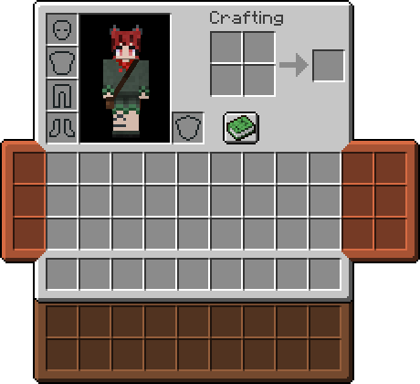

# Scout

[Modrinth](https://modrinth.com/mod/scout) | [CurseForge](https://www.curseforge.com/minecraft/mc-mods/scout)

A mod focused on "physically" extending the inventory (adding slots) through wearing various types of bags. Heavily inspired by makamys' [Satchels](https://github.com/makamys/Satchels).

Items are retained on the bag items themselves. The bag items are equipped through [Trinkets](https://modrinth.com/mod/trinkets) slots. A new slot type for pouches is added, with two slots.

## Credits

- makamys - Original inspiration from Satchels
- Emi - Trinkets
- Kat - Original pouch texture, taken from an older mod of mine and reworked for Scout
